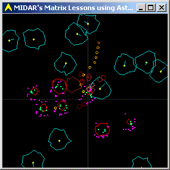



## A Matrix Multiplication Lesson using the game Asteroids

### Description

Originally started off as a lesson in Matrix Multiplication using 3D vectors; And by "3D vectors", I don't mean 3D computer graphics... I mean "vectors". I was actually half way through coding a 3D computer graphics program, when I

decided I needed a refresher course in matrix multiplication... for you see to do 3D graphics, I actually use "4D vectors". Confused? Well... so was I, so I decided to drop back a dimension and learn all over from "2D graphics using 3D vectors", so that I could understand "3D graphics using 4D vectors".

Anyway... so the matrix math is going well, when I think to myself, "Hmmm... maybe I should create an Asteroids game"

Well... I'm half-way through debugging the AI routine for the enemy spaceships, when I decide that with all of my debugging graphics turned on, it looked kind of cool, so I thought you would want to see it before I pull out all the debugging graphics. The actually Asteroids game will probably be finished in another month or so. I don't want to release it until I've got a kick-ass AI routine for the enemy space ships (basically I want to make computer controlled ships, just as smart as human players)
 
### More Info
 

             |
---                |---
**Submitted On**   |2003-02-16 00:47:36
**By**             |[Peter Wilson](https://github.com/Planet-Source-Code/PSCIndex/blob/master/ByAuthor/peter-wilson.md)
**Level**          |Beginner
**User Rating**    |4.3 (13 globes from 3 users)
**Compatibility**  |VB 6\.0
**Category**       |[Graphics](https://github.com/Planet-Source-Code/PSCIndex/blob/master/ByCategory/graphics__1-46.md)
**World**          |[Visual Basic](https://github.com/Planet-Source-Code/PSCIndex/blob/master/ByWorld/visual-basic.md)
**Archive File**   |[A\_Matrix\_M1545062162003\.zip](https://github.com/Planet-Source-Code/peter-wilson-a-matrix-multiplication-lesson-using-the-game-asteroids__1-43248/archive/master.zip)

